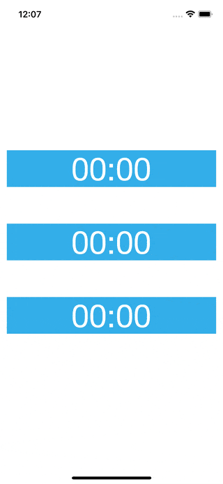

# WWCountdownButton
[](https://developer.apple.com/swift/) [](https://developer.apple.com/swift/) [](https://developer.apple.com/swift/) [](https://developer.apple.com/swift/)

A countdown button.
一個倒數計時的按鈕.



### [Installation with Swift Package Manager](https://medium.com/彼得潘的-swift-ios-app-開發問題解答集/使用-spm-安裝第三方套件-xcode-11-新功能-2c4ffcf85b4b)
```
dependencies: [
    .package(url: "https://github.com/William-Weng/WWCountdownButton.git", .upToNextMajor(from: "1.0.0"))
]
```

### Example
```swift
import UIKit
import WWCountdownButton
import WWPrint

final class ViewController: UIViewController {

    override func viewDidLoad() { super.viewDidLoad() }
    
    @IBAction func countdown1(_ sender: WWCountdownButton) { sender.countdown(second: 120) }
    
    @IBAction func countdown2(_ sender: WWCountdownButton) { sender.countdown(second: 60, isCountdown: false) }
    
    @IBAction func countdown3(_ sender: WWCountdownButton) {
        
        sender.countdown(second: 5) { info in
            if (info.isFinish) { sender.backgroundColor = .darkGray }
            wwPrint(info)
        }
    }
}
```
